# Arsitektur Sistem — SIMKlinik

> Dokumen ini menggambarkan arsitektur **sebagaimana sudah dibangun** sampai
> Sprint 1 task S1-08. Bagian yang masih rencana ditandai **⏳ Belum dibangun**
> dan merujuk ke [PRD](../PRD-SIM-Klinik-SaaS.md) atau
> [Sprint 1](../Sprint-1-Fondasi.md).
>
> Kalau dokumen ini dan kode berbeda, kode yang benar. Perbarui dokumen ini di
> PR yang sama dengan perubahan arsitekturnya.

## Daftar isi

1. [Ringkasan](#1-ringkasan)
2. [Konteks sistem](#2-konteks-sistem)
3. [Stack teknologi](#3-stack-teknologi)
4. [Model multi-tenant](#4-model-multi-tenant)
5. [Domain & routing](#5-domain--routing)
6. [Siklus hidup request](#6-siklus-hidup-request)
7. [Lapisan data](#7-lapisan-data)
8. [Siklus hidup tenant](#8-siklus-hidup-tenant)
9. [Autentikasi](#9-autentikasi)
10. [Otorisasi (RBAC)](#10-otorisasi-rbac)
11. [State proses & isolasi](#11-state-proses--isolasi)
12. [Audit trail](#12-audit-trail)
13. [Antrian & worker](#13-antrian--worker)
14. [Lapisan keamanan](#14-lapisan-keamanan)
15. [Frontend](#15-frontend)
16. [Strategi testing](#16-strategi-testing)
17. [Lingkungan pengembangan](#17-lingkungan-pengembangan)
18. [Peta kode](#18-peta-kode)
19. [Catatan keputusan](#19-catatan-keputusan)
20. [Belum dibangun & utang yang diketahui](#20-belum-dibangun--utang-yang-diketahui)

---

## 1. Ringkasan

SIMKlinik adalah SaaS rekam medis elektronik untuk klinik di Indonesia. Setiap
klinik (**tenant**) punya:

- **subdomain** sendiri: `klinik-melati.simklinik.id`
- **database MySQL** sendiri: `simklinik_klinik_melati`
- **user MySQL** sendiri, yang hanya punya grant ke database itu

Satu codebase Laravel dan satu deployment melayani semua klinik. Database
**pusat** hanya menyimpan registry tenant dan tidak pernah berisi data klinis.

Prinsip yang menentukan hampir semua keputusan di bawah: **isolasi antar klinik
harus struktural, bukan disiplin.** Tidak ada `where tenant_id = ?` yang bisa
terlupa, karena data klinik lain secara fisik berada di database yang tidak bisa
dijangkau koneksi aktif.

---

## 2. Konteks sistem

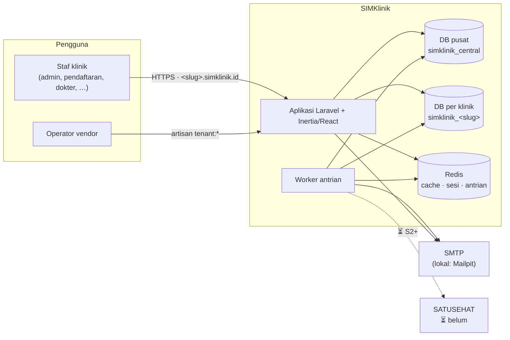

---

## 3. Stack teknologi

| Lapisan | Pilihan | Catatan |
|---|---|---|
| Bahasa & framework | PHP 8.3+, Laravel 12 | |
| Multi-tenancy | `stancl/tenancy` v3 | Mode multi-database, identifikasi subdomain |
| Frontend | Inertia.js 2 + React 19 + TypeScript | Tanpa lapisan API terpisah |
| Styling | Tailwind CSS v4 | Komponen dasar gaya shadcn di `resources/js/Components/ui` |
| Build | Vite 7 | |
| Database | MySQL 8.4 | Bukan MariaDB — perilaku JSON/CTE/indeks berbeda |
| Cache, sesi, antrian | Redis 7 | Client `predis` di dev, `phpredis` direkomendasikan di produksi |
| Otorisasi | `spatie/laravel-permission` v8 | Tabelnya di database tenant |
| Antrian | Laravel Horizon 5 | Dashboard di `admin.<domain>/horizon`, basic auth |
| Email lokal | Mailpit | |
| Testing | Pest 4 | Melawan MySQL & Redis sungguhan |

---

## 4. Model multi-tenant

### 4.1 Tiga lapis isolasi

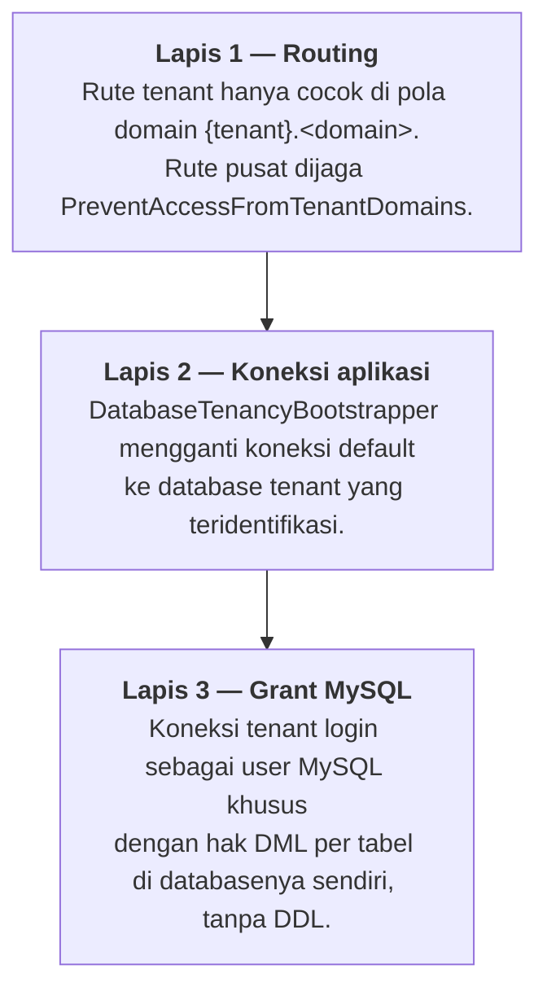

Lapis 3 tetap menahan meskipun lapis 1 dan 2 salah konfigurasi: user MySQL
klinik A **ditolak oleh MySQL** saat membaca database klinik B. Hal ini diuji di
`TenantProvisioningTest`. Lapis yang sama membuat `audit_logs` append-only dan
data klinis tidak bisa di-hard-delete, bahkan lewat query mentah (§7.3).

### 4.2 Yang dibuat tenant-aware

| Bootstrapper / mekanisme | Efek |
|---|---|
| `DatabaseTenancyBootstrapper` | Koneksi default → `tenant` (database & user MySQL klinik) |
| `CacheTenancyBootstrapper` | `cache()->get/put` diberi tag `tenant<id>` |
| `FilesystemTenancyBootstrapper` | `storage_path()` & disk `local`/`public` di-suffix per tenant |
| `QueueTenancyBootstrapper` | Job yang di-dispatch dari konteks tenant membawa `tenant_id`; worker menginisialisasi tenancy sebelum job di-unserialize (§13) |
| Listener di `TenancyServiceProvider` | Reset singleton yang membawa state tenant (§11) |

> **Perhatian:** `CacheTenancyBootstrapper` **hanya** men-tag panggilan yang
> lewat `__call` pada cache manager. Kode yang memanggil `store()` atau
> `driver()` langsung — misalnya `RateLimiter` dan spatie permission — **tidak**
> ter-scope otomatis. Lihat §11.

---

## 5. Domain & routing

### 5.1 Pemetaan host

| Host | Konteks | Dilayani oleh |
|---|---|---|
| `simklinik.localhost` / `simklinik.id` | Pusat | `routes/central.php` |
| `admin.simklinik.*` | Pusat (subdomain dipesan) | `routes/central.php`, dashboard Horizon `/horizon` |
| `<slug>.simklinik.*` | Tenant | `routes/tenant.php` |
| Host lain | — | 404 "Klinik tidak ditemukan" |

Domain dibaca dari env `CENTRAL_DOMAIN` dan `CENTRAL_DOMAINS`. Subdomain yang
dipesan (`admin`, `www`, `api`, `horizon`, dll.) ada di
`config/tenancy.php → reserved_subdomains`.

Di lokal dipakai `.localhost`, karena Chrome, Safari, dan Firefox meresolvenya ke
127.0.0.1 tanpa dnsmasq atau `/etc/hosts`.

### 5.2 Pemisahan di level pencocokan rute

```php
// routes/tenant.php
Route::domain('{tenant}.'.$centralDomain)
    ->where(['tenant' => "(?!(?:admin|www|…)\\.)".TenantSlug::PATTERN])
```

- Rute **tenant** didaftarkan **lebih dulu** (`bootstrap/app.php`) dan dibatasi
  pola domain. Kalau urutannya dibalik, `/` di subdomain klinik akan dilayani
  landing page pusat tanpa satu pun error.
- Rute **pusat** tidak dibatasi domain (supaya nama rutenya unik dan bisa
  di-cache), tetapi dijaga `PreventAccessFromTenantDomains`.
- Parameter `{tenant}` dibuang dari rute oleh `EnsureTenantIsUsable`, dan diisi
  otomatis untuk `route()` lewat `URL::defaults()` saat tenancy aktif.
- Pola slug (`TenantSlug::PATTERN`) dipakai bersama oleh validasi dan constraint
  rute. Hasilnya, tidak mungkin ada slug yang lolos validasi tetapi tidak cocok
  dengan rute.

### 5.3 Rute yang tersedia

| Metode | Path (di subdomain tenant) | Nama | Proteksi |
|---|---|---|---|
| GET/POST | `/login` | `login`, `login.store` | guest, throttle per tenant |
| GET/POST | `/forgot-password` | `password.request`, `password.email` | guest, `throttle:tenant-password-email` |
| GET/POST | `/reset-password/{token}`, `/reset-password` | `password.reset`, `password.store` | guest |
| GET/POST | `/invitation/{token}`, `/invitation` | `invitation.accept`, `invitation.store` | guest |
| GET | `/` | `tenant.dashboard` | auth, idle |
| GET | `/session/heartbeat` | `session.heartbeat` | auth, idle |
| POST | `/logout` | `logout` | auth, idle |
| GET | `/users` | `users.index` | auth, idle, `permission:user.view` + policy |
| GET/POST | `/users/create`, `/users` | `users.create`, `users.store` | auth, idle, `permission:user.create` + policy |
| GET | `/audit-logs` | `audit-logs.index` | auth, idle, `permission:audit_log.view` |

Rute pusat: `GET /` (`central.home`), `GET /up` (health check), dan dashboard
Horizon di `admin.<domain>/horizon` (dibatasi domain, basic auth).

Middleware tambahan yang bisa dipasang di rute: `audit.access:<parameter>` untuk
mencatat akses baca rekam medis (§12.3).

---

## 6. Siklus hidup request

### 6.1 Urutan middleware rute tenant

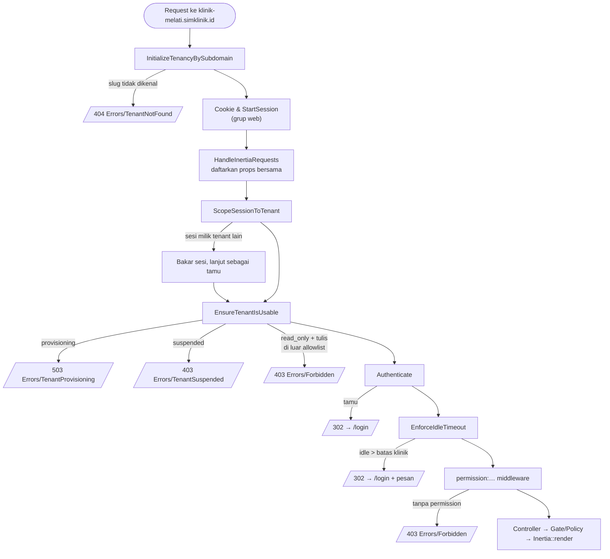

Sebelum semua itu, `AssignRequestId` (grup `web`) memberi request id korelasi
yang dicatat di setiap baris audit, dikembalikan di header `X-Request-Id`, dan
ikut terbawa ke job antrian lewat Context Laravel.

**Urutan ini dipaksakan secara eksplisit** di
`TenancyServiceProvider::makeTenancyMiddlewareHighestPriority()`. Laravel
mengurutkan ulang middleware yang ada di daftar prioritasnya, dan `Authenticate`
termasuk di daftar itu. Tanpa penetapan eksplisit, `auth` akan berjalan sebelum
gerbang status tenant, sehingga klinik yang ditangguhkan mengarahkan tamu ke
halaman login alih-alih menjelaskan bahwa aksesnya dihentikan.

### 6.2 Aturan status tenant

| Status | Baca | Tulis | Login |
|---|---|---|---|
| `provisioning` | ✗ (503) | ✗ | ✗ |
| `active` | ✓ | ✓ | ✓ |
| `read_only` | ✓ | ✗ (403) kecuali allowlist | ✓ |
| `suspended` | ✗ (403) | ✗ | ✗ |

Allowlist tulis di mode `read_only`: `login.store`, `logout`, `password.email`,
`password.store`, `invitation.store`. Semuanya jalur untuk *masuk* ke sistem.
Memblokir login sama saja memblokir akses baca rekam medis, yang dilarang
**FR-M23.4**.

Aturan ini hidup di `App\Enums\TenantStatus` (`allowsAccess()`,
`allowsWrites()`), bukan tersebar di middleware.

### 6.3 Penanganan error

Diatur di `bootstrap/app.php → withExceptions`:

- **403** selalu dirender sebagai `Errors/Forbidden`. Bila pengguna sudah login di
  dalam klinik, kejadian `access_denied` dicatat ke jejak audit. Pesan dari Laravel/spatie
  diganti pesan generik berbahasa Indonesia; hanya pesan dari `abort(403, '…')`
  yang diteruskan (`App\Support\ForbiddenMessage`).
- **419** (CSRF kedaluwarsa) diarahkan kembali ke halaman sebelumnya dengan
  pesan flash.

---

## 7. Lapisan data

### 7.1 Database pusat — `simklinik_central`

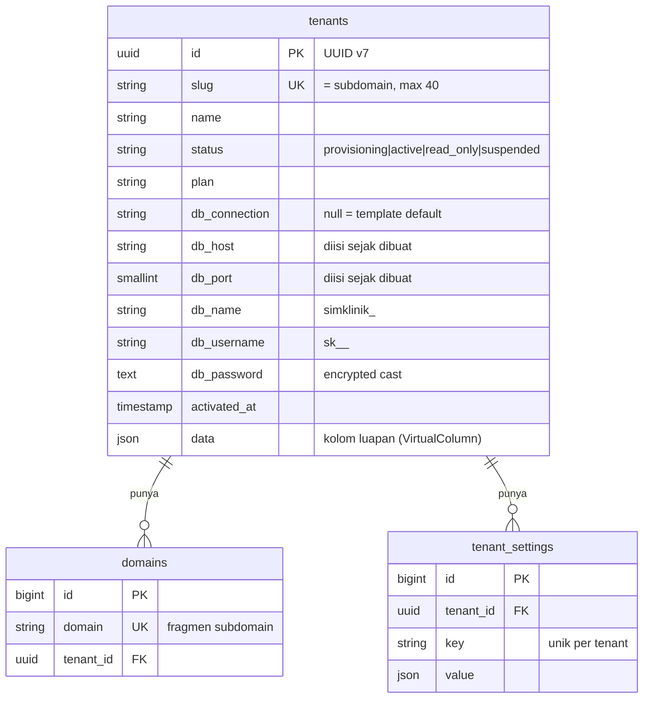

Tabel lain di pusat: `cache`, `cache_locks`, `jobs`, `job_batches`,
`failed_jobs` (bawaan Laravel).

**Tentang kolom `db_*`.** `Tenant::internalPrefix()` dikosongkan, sehingga
`stancl/tenancy` membaca semua kolom berawalan `db_` langsung sebagai konfigurasi
koneksi PDO (`db_host` → `host`). Dua konsekuensinya:

- **Jangan** menambah kolom berawalan `db_` untuk keperluan lain.
- Kolom `db_*` bernilai null diabaikan (`TenantDatabaseConfig`), bukan menimpa
  nilai koneksi template dengan null.

**Kolom luapan `data`** menyimpan atribut sementara selama provisioning:
`admin_email`, `admin_name`, `provisioning_step`, `provisioning_owns_database`.

### 7.2 Database tenant — `simklinik_<slug>`

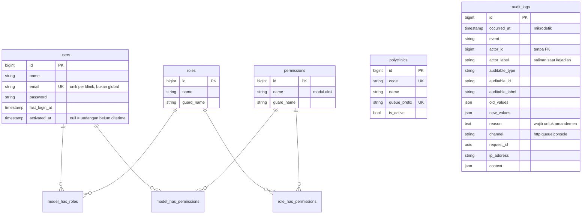

Tabel lain: `password_reset_tokens`, `user_invitation_tokens`, `sessions`,
`migrations`.

Migrasi tenant ada di `database/migrations/tenant/` dan dijalankan dengan
`php artisan tenants:migrate`. Migrasi pusat (`database/migrations/`) tidak
pernah menyentuhnya, karena Laravel tidak memindai subfolder.

### 7.3 Hak akses MySQL per tabel

MySQL **tidak bisa** mencabut hak di level tabel yang diberikan di level
database. Selama user runtime memegang `DELETE ON db.*`, perintah
`REVOKE DELETE ON db.audit_logs` ditolak. Karena itu setiap tenant punya dua
cara masuk ke databasenya:

| Koneksi | Kredensial | Hak | Dipakai untuk |
|---|---|---|---|
| `tenant` | user MySQL tenant (`sk_…`) | DML **per tabel**, tanpa DDL | Semua kode aplikasi, seeder, worker |
| `tenant_migrator` | admin pusat | Penuh | `tenants:migrate` / `tenants:rollback` saja |

Kebijakan hak ada di `config/simklinik.php → database_grants`:

| Tabel | Hak user runtime |
|---|---|
| (bawaan) | `SELECT, INSERT, UPDATE, DELETE` |
| `audit_logs` | `SELECT, INSERT` — append-only |
| `migrations` | `SELECT` |
| tabel klinis (Sprint 2) | **wajib** `SELECT, INSERT, UPDATE` — tanpa `DELETE` |

`TenantDatabaseGrants::sync()` menerapkan kebijakan itu sebagai selisih (grant
yang kurang, revoke yang lebih). Ia berjalan otomatis setelah setiap
`tenants:migrate` dan `tenants:rollback` (event `DatabaseMigrated` /
`DatabaseRolledBack`), sehingga tabel baru langsung mendapat hak yang benar.
Tenant yang dibuat sebelum kebijakan ini (dengan hak level database) ikut
dirapikan pada migrasi berikutnya.

User MySQL baru dibuat **tanpa grant apa pun** dan baru mendapat hak per tabel
setelah migrasi pertama.

### 7.4 Aturan evolusi skema

Satu codebase melayani semua tenant. Kalau `tenants:migrate` gagal di tenant
ke-30, tenant itu tertinggal di skema lama sementara kodenya sudah baru. Karena
itu:

1. **Expand → deploy → backfill → contract.** Tambah kolom nullable di migrasi
   baru, deploy kode yang kompatibel dengan kedua bentuk, isi data, baru hapus
   yang lama di migrasi terpisah.
2. **Jangan menyunting migrasi yang sudah jalan.** Contohnya
   `add_account_fields_to_users_table` dibuat terpisah, walaupun belum ada
   tenant produksi.
4. **Tabel baru yang butuh hak berbeda dari bawaan** didaftarkan di
   `database_grants` di commit yang sama dengan migrasinya.
3. **Jangan `JOIN` lintas database** (misalnya ke master ICD-10 di pusat). Itu
   akan mengunci tenant ke server yang sama. Gabungkan di layer aplikasi.

---

## 8. Siklus hidup tenant

### 8.1 Diagram status

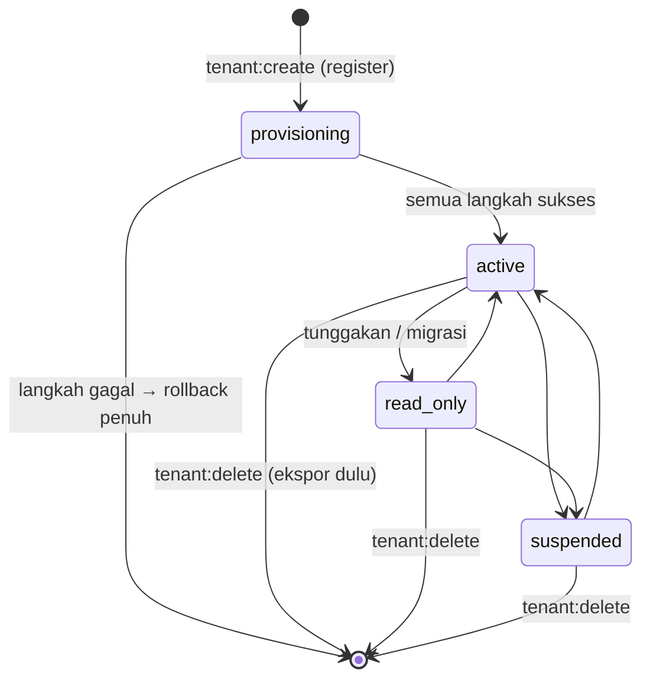

⏳ Perubahan status lewat UI menyusul di panel vendor (S1-10). Saat ini
perubahan dilakukan lewat tinker.

### 8.2 Provisioning

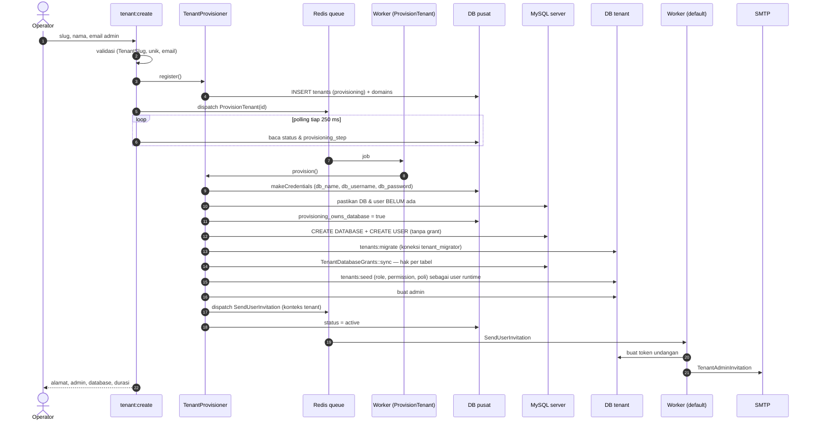

Langkah-langkahnya (`TenantProvisioner::STEPS`): `create_database` → `migrate` →
`seed` → `create_admin` → `send_invitation` → `activate`. `ProvisionTenant`
berjalan di antrian `provisioning`. Langkah `send_invitation` hanya
**menjadwalkan** email di antrian `default`: SMTP yang tersendat di-retry sendiri
oleh job itu dan tidak membongkar klinik yang sudah siap. Setiap langkah yang
selesai memancarkan event `TenantProvisioningStepCompleted`.

**Rollback** (`TenantProvisioner::abandon()`):

- Dijalankan kalau langkah mana pun melempar exception, **atau** dari
  `ProvisionTenant::failed()` ketika worker di-kill karena timeout (saat blok
  `catch` tidak sempat berjalan).
- Database dan user MySQL hanya dihapus kalau `provisioning_owns_database`
  bernilai true. Flag ini baru diset **setelah** dipastikan nama database belum
  ada, sehingga database milik orang lain dengan nama bentrok tidak pernah
  terhapus.
- Baris tenant dihapus **tanpa** event model, supaya pipeline `TenantDeleted`
  tidak ikut menghapus database yang bukan milik kita.
- Pesan kegagalan disimpan di cache selama 10 menit agar bisa dibaca
  `tenant:create` yang sedang menunggu di proses lain.

Kredensial user MySQL:

- Username: `sk_<slug≤20>_<6 acak>`, maksimal 32 karakter.
- Password: 40 karakter **alfanumerik saja**. Manager paket menyisipkan password
  ke `CREATE USER … IDENTIFIED BY '…'` tanpa escaping.

### 8.3 Penghapusan

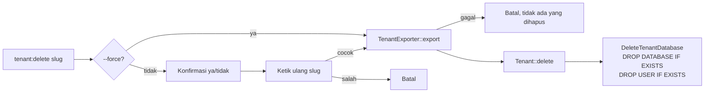

Arsip ekspor disimpan di `storage/app/private/tenant-exports/<slug>-<waktu>-<acak>.zip`
dengan izin `0600`. Isinya:

```
manifest.json         metadata tenant (tanpa kredensial), jumlah baris per tabel
schema.sql            SHOW CREATE TABLE semua tabel
tables/<tabel>.jsonl  satu baris JSON per record; nilai biner → {"$binary": base64}
```

Tidak ada flag untuk melewati ekspor, karena Permenkes 24/2022 mewajibkan
retensi rekam medis 25 tahun.

---

## 9. Autentikasi

Seluruh autentikasi hidup di **rute tenant**, karena tabel `users` ada di
database tenant. Guard yang dipakai adalah `web` (sesi) dengan provider
Eloquent `App\Models\User`.

| Aspek | Implementasi |
|---|---|
| Login | `LoginRequest` — pesan sama untuk email tak terdaftar dan password salah |
| Throttle login | 5 percobaan / 60 detik per **(tenant, email, IP)** |
| "Ingat saya" | Tidak ada. Komputer klinik dipakai bergantian |
| Session fixation | `session()->regenerate()` setelah login |
| Password | Min. 10 karakter, huruf + angka (`Password::defaults`) |
| Reset password | Broker `users`, tabel `password_reset_tokens`, **60 menit**, throttle per tenant |
| Undangan | Broker `invitations`, tabel `user_invitation_tokens`, **72 jam** |
| Lupa password | Jawaban **dan waktu respons** identik untuk email terdaftar dan tidak: request selalu hanya men-dispatch `SendPasswordResetLink` |
| Idle timeout | Bawaan 15 menit (`SESSION_IDLE_TIMEOUT`), per klinik lewat `tenant_settings.session.idle_timeout_minutes`, dijepit ke 5–120 |

### 9.1 Idle timeout — dua sisi

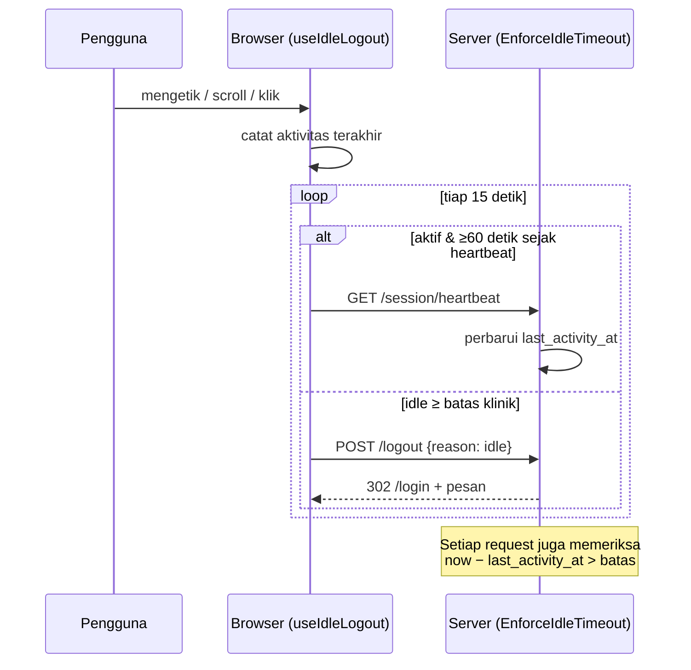

- **Sisi server** menjamin batas tetap berlaku walaupun JavaScript mati.
- **Sisi klien** memastikan layar berisi data pasien tidak tetap terbuka di meja
  yang ditinggal.
- **Heartbeat** menjaga form panjang (misalnya anamnesis) yang diketik tanpa
  pindah halaman agar tidak berujung logout saat disimpan.

### 9.2 Pengikatan sesi ke tenant

Cookie sesi terikat pada host (`SESSION_DOMAIN=null`). Selain itu,
`ScopeSessionToTenant` menyimpan `_tenant_id` di sesi. Kalau sebuah sesi dibawa
ke tenant lain, sesinya **dibakar** (`invalidate()`) dan request diteruskan
sebagai tamu, lalu kejadian itu dicatat sebagai warning di log.

> Middleware ini menggantikan `Stancl\Tenancy\Middleware\ScopeSessions`. Versi
> paket menjawab 403 tetapi membiarkan sesi utuh. Halaman 403 lalu me-resolve
> user dari sesi itu, sehingga identitas user ber-id sama di klinik lain bocor
> lewat props Inertia.

---

## 10. Otorisasi (RBAC)

### 10.1 Sumber kebenaran

Semua permission dan peran bawaan didefinisikan di
[`app/Support/Rbac/PermissionCatalog.php`](../app/Support/Rbac/PermissionCatalog.php):

- **92 permission** berpola `modul.aksi`. Aksi didefinisikan **per modul**
  (tidak ada `queue.sign`), termasuk modul yang belum dibangun.
- **8 peran bawaan** (FR-M21.1):

| Peran | Label | Cakupan singkat |
|---|---|---|
| `clinic_admin` | Admin Klinik | Pengguna, peran, audit, pengaturan, SATUSEHAT, laporan — **tanpa rekam medis** |
| `registrar` | Petugas Pendaftaran | Pasien (tanpa export/merge), consent, antrian, BPJS |
| `nurse` | Perawat | Anamnesis, TTV, KIA, imunisasi, PTM |
| `practitioner` | Dokter | Seluruh pelayanan klinis + break-glass |
| `pharmacist` | Apoteker | Resep (lihat), pelayanan resep, stok |
| `lab_staff` | Petugas Laboratorium | Permintaan & hasil lab |
| `cashier` | Kasir | Tagihan, tutup kas |
| `medical_record_officer` | Petugas Rekam Medis | Pasien (termasuk merge/export), resume, rujukan, laporan |

`RolesAndPermissionsSeeder` bersifat idempoten. Seeder ini menambah permission
baru, menyinkronkan permission peran **bawaan**, dan tidak menyentuh peran
**kustom**:

```bash
php artisan tenants:seed --class='Database\Seeders\RolesAndPermissionsSeeder' --force
```

### 10.2 Tiga titik penegakan

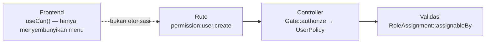

- Tidak ada `Gate::before` yang meloloskan admin untuk semua hal.
- **Anti-eskalasi** (`RoleAssignment`): seseorang hanya bisa memberikan peran
  yang permission **administratifnya** (`user`, `role`, `audit_log`,
  `clinic_setting`, `satusehat`) sudah ia miliki. Permission klinis tidak
  dihitung, supaya admin tetap bisa menugaskan dokter.
- `medical_record.break_glass` sengaja **tidak** dianggap administratif. Ini
  kewenangan klinis darurat yang (nanti) diaudit.

---

## 11. State proses & isolasi

Di PHP-FPM, satu request dilayani satu proses yang lalu mati. Namun **worker
antrian, perintah artisan multi-tenant, dan suite test** menjalankan banyak
tenant dalam satu proses. Singleton yang dibuat untuk tenant A akan dipakai
ulang untuk tenant B tanpa error.

| Singleton / mekanisme | Risiko jika tidak ditangani | Penanganan |
|---|---|---|
| `PermissionRegistrar` (spatie) | Peta permission tenant A disajikan untuk B (cache via `store()`, tanpa tag) | Kunci cache `spatie.permission.cache.tenant.<id>` + `initializeCache()` saat bootstrap & revert |
| `RateLimiter` | 5 login gagal di A mengunci email yang sama di B | Id tenant eksplisit di kunci throttle |
| Password broker | Token undangan tenant B tertulis ke database A | `forgetInstance('auth.password')` saat bootstrap & revert |
| Guard auth | User id 7 dari A dipakai di B | `forgetGuards()` saat kembali ke pusat |
| URL generator | `route()` di tenant gagal (parameter `{tenant}` kosong) | `URL::defaults(['tenant' => slug])` |
| Koneksi `tenant_migrator` | Migrasi tenant B berjalan di database tenant A | Didefinisikan ulang + `DB::purge()` saat bootstrap, dihapus saat revert |
| Konteks tenant di worker | Job klinik A berjalan dengan database klinik B | `QueueTenancyBootstrapper` + verifikasi di `TenantAwareJob` (§13) |

Semua penanganan ini ada di
`TenancyServiceProvider::resetProcessStateOnTenantSwitch()`.

> **Aturan untuk kode baru:** setiap paket yang menyimpan state di singleton,
> atau yang memanggil `Cache::store()`/`driver()` langsung, harus diperiksa
> terhadap tabel di atas. Tambahkan test isolasinya di
> `tests/Feature/TenantIsolationTest.php` **sebelum** memperbaiki.

---

## 12. Audit trail

Memenuhi PRD M22 (FR-M22.1–FR-M22.4). Jejak audit hidup di tabel `audit_logs`
**di database setiap klinik**, bukan di pusat, sehingga ikut terekspor, ikut
terisolasi, dan tidak pernah terbaca oleh vendor dari konteks pusat.

### 12.1 Apa yang dicatat

| Sumber | Kejadian | Di mana |
|---|---|---|
| Model ber-trait `Auditable` (`User`, `Polyclinic`, semua `ClinicalModel`) | `created`, `updated`, `deleted`, `amended` + nilai sebelum/sesudah | `App\Models\Concerns\Auditable` |
| Event autentikasi Laravel | `login`, `logout` (+ alasan: manual / idle klien / idle server), `login_failed` (+ email yang dicoba), `lockout`, `password_reset` | `App\Listeners\AuditSecurityEvents` |
| Undangan | `invitation_accepted` | `AcceptInvitationController` |
| Event spatie (`events_enabled`) | `role_assigned`, `role_revoked` | `AuditSecurityEvents` |
| Exception handler | `access_denied` (hanya pengguna yang sudah login) | `bootstrap/app.php` |
| `ScopeSessionToTenant` | `session_rejected` — dicatat di klinik yang **dituju** | middleware |
| Middleware `audit.access` | `viewed` — akses baca satu rekam medis | `LogRecordAccess` |

Setiap baris membawa: aktor (id + label salinan), subjek (tipe, id, label
salinan), kanal (`http`/`queue`/`console`), `request_id`, IP, dan user agent
(khusus kanal http).

Yang **tidak** dicatat: nilai kolom rahasia (`password`, `remember_token`,
`token`, `db_password` → `[disamarkan]`, tetapi faktanya berubah tetap
tercatat), `created_at`/`updated_at`, `last_login_at` (sudah tercatat sebagai
`login`), dan pembukaan halaman log audit itu sendiri.

### 12.2 Append-only

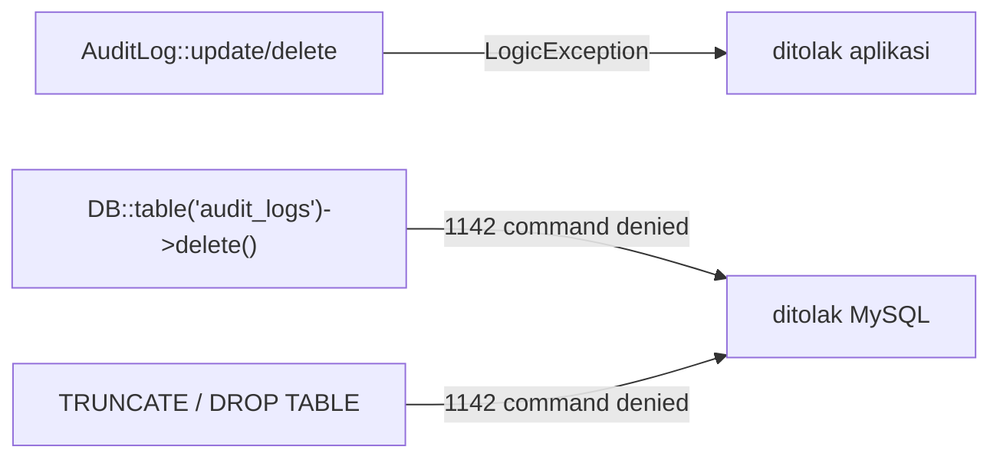

Penegak utamanya adalah hak MySQL (§7.3), bukan kode. Tinker, query mentah, dan
celah SQL injection semuanya berjalan sebagai user runtime yang tidak memegang
`UPDATE`/`DELETE` atas tabel ini. Satu-satunya yang bisa mengubah baris audit
adalah admin MySQL di luar aplikasi (lihat §20: rantai hash).

### 12.3 Akses baca rekam medis

```php
Route::get('/patients/{patient}', …)->middleware('audit.access:patient');
```

- Dipasang di rute yang membuka **satu** rekam medis, bukan di rute daftar.
  Mencatat setiap baris daftar pasien menghasilkan ratusan baris per halaman
  tanpa menjawab pertanyaan saat sengketa: *siapa yang membuka rekam medis ini?*
- Hanya respons **2xx** yang dicatat sebagai `viewed`. Penolakan oleh policy di
  dalam controller tercatat sebagai `access_denied`.
- Akses berulang oleh orang yang sama atas rekam medis yang sama dalam
  `AUDIT_ACCESS_DEDUP_SECONDS` (bawaan 60) dicatat sekali. Deduplikasi tidak
  atomik; dua request yang benar-benar bersamaan bisa menulis dua baris, dan
  kelebihan catat adalah arah kesalahan yang aman.

### 12.4 Data klinis tanpa hard delete

Semua model klinis (Sprint 2) **wajib** mewarisi `App\Models\ClinicalModel`.

| Jalan menghapus | Penolak |
|---|---|
| `$model->delete()`, `forceDelete()`, `Model::destroy()` | `HardDeleteForbiddenException` |
| `Model::where(…)->delete()`, `->truncate()` | `ClinicalBuilder` |
| `DB::table('…')->delete()` | MySQL — tabel didaftarkan tanpa `DELETE` |

Lapis ketiga dijaga test: setiap subkelas `ClinicalModel` yang tabelnya masih
boleh `DELETE` membuat suite gagal.

Koreksi dilakukan dengan `amend($perubahan, $alasan)`. Alasan wajib (minimal 10
karakter) dan kejadiannya dicatat sebagai `amended` beserta nilai lama dan baru.
`update()` biasa tetap diizinkan dan dicatat sebagai `updated`; aturan "record
yang sudah final hanya boleh diamandemen" (FR-M3.8) adalah logika domain
Sprint 2.

### 12.5 Batas yang perlu diketahui

Event model tidak berbunyi untuk `saveQuietly()`, `Model::withoutEvents()`, dan
update massal lewat query builder. Pemakaiannya adalah pilihan sadar yang harus
terlihat di code review.

---

## 13. Antrian & worker

### 13.1 Topologi

| Antrian | Supervisor Horizon | Isi | Timeout | Tries |
|---|---|---|---|---|
| `provisioning` | `supervisor-provisioning` (1 proses) | `ProvisionTenant` | 180 s | 1 |
| `default` | `supervisor-tenant` (auto-balance) | `SendUserInvitation`, `SendPasswordResetLink`, (S2) sinkronisasi SATUSEHAT | 60 s | 3 |

`retry_after` Redis = **240 detik**, dan harus selalu lebih besar dari timeout
terlama. Kalau tidak, Redis menyerahkan job yang masih berjalan ke worker kedua
(dua provisioning bersamaan untuk satu klinik). Invarian ini dijaga dua kali:
test untuk nilai bawaan, dan `QueueTimeoutGuard` yang **menolak menjalankan
worker** (`horizon`, `queue:work`, …) kalau `.env` melanggarnya.

`after_commit` aktif: job yang di-dispatch di dalam transaksi baru masuk antrian
setelah commit.

### 13.2 `TenantAwareJob`

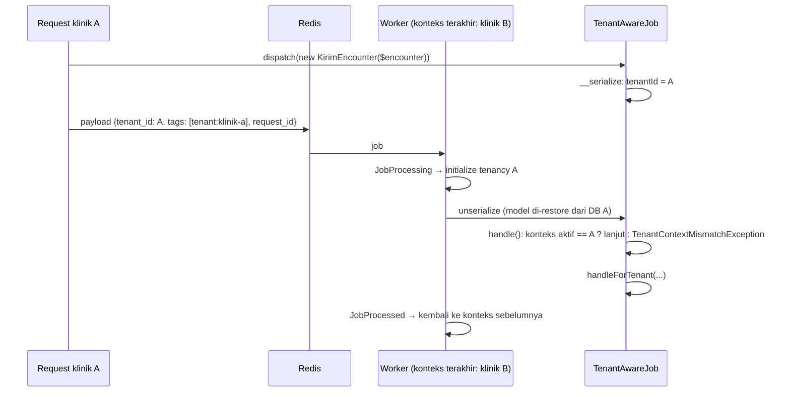

Jaminannya:

1. Tenant pemilik ditangkap **saat serialisasi**. Subkelas tidak perlu memanggil
   `parent::__construct()`, dan dispatch dari konteks pusat langsung gagal.
2. Tenancy di worker diinisialisasi **sebelum** model di properti job
   di-restore, sehingga `Encounter $encounter` dibaca dari database yang benar.
3. Konteks diverifikasi sebelum `handleForTenant()`. Kalau tidak cocok, job
   gagal keras tanpa efek samping. Sistem **tidak** mencoba "memindahkan"
   konteks, karena model di properti mungkin sudah di-restore dari database
   yang salah.

Job pusat (misalnya `ProvisionTenant`) memakai `ShouldQueue` biasa dan berjalan
tanpa tenancy; `QueueTenancyBootstrapper` mengakhiri konteks tenant yang
tertinggal sebelum job pusat berjalan.

### 13.3 Aturan untuk job baru

- **Jangan menaruh rahasia di properti job.** Horizon menampilkan payload.
  Token undangan dan reset password dibuat **di dalam** worker; payload hanya
  berisi identitas user atau email. Ini bukan soal kerapian: operator vendor
  yang membaca token dari Horizon bisa mengambil alih akun klinik, padahal
  vendor tidak boleh punya akses ke data klinis (PRD §4.2).
- **Dispatch di dalam `$tenant->run()` memakai closure berblok**, bukan arrow
  function. `fn () => Job::dispatch()` mengembalikan `PendingDispatch` yang baru
  di-dispatch setelah `run()` selesai, alias tanpa konteks tenant.
  `TenantAwareJob` membuat kesalahan ini gagal keras.
- Notifikasi berisi token dikirim dengan `notifyNow()` dari dalam job, bukan
  sebagai notifikasi ter-queue kedua.

### 13.4 Observabilitas

- Setiap job yang di-dispatch dari dalam klinik mendapat tag `tenant:<slug>`
  (hook `Queue::createPayloadUsing` di `AppServiceProvider`), termasuk job yang
  tidak kita tulis sendiri.
- Baris audit dari worker bertanda kanal `queue` dan membawa `request_id`
  request pemicunya.
- Dashboard Horizon hanya di `admin.<domain>/horizon`, dengan basic auth
  **fail-closed** (kredensial kosong berarti tertutup, termasuk di `local`,
  berbeda dengan bawaan Horizon). Gate Horizon juga menolak kalau middleware
  basic auth tercabut dari konfigurasi.

---

## 14. Lapisan keamanan

| Ancaman | Kontrol |
|---|---|
| Membaca data klinik lain | Database terpisah + grant MySQL per tenant + pemisahan rute |
| Pencurian cookie lintas klinik | Cookie terikat host + `ScopeSessionToTenant` membakar sesi asing |
| Kredensial database bocor lewat dump | `db_password` terenkripsi dengan `APP_KEY` (di environment, bukan database) |
| Brute force login | Throttle per (tenant, email, IP) |
| Enumerasi staf klinik | Pesan login & lupa password seragam |
| Eskalasi hak lewat `user.create` | `RoleAssignment` |
| Layar ditinggal terbuka | Idle logout server + klien |
| SQL injection lewat password MySQL | Password generator alfanumerik |
| Informasi internal di halaman error | 404/403 yang ramah; pesan Laravel/spatie tidak diteruskan |
| Penghapusan data tanpa jejak | Ekspor wajib sebelum `tenant:delete` |
| Rollback menghapus data orang lain | Flag kepemilikan database |
| Pemalsuan / penghapusan jejak audit | `audit_logs` hanya `SELECT, INSERT` bagi user runtime |
| Hard delete data klinis | `ClinicalModel` + `ClinicalBuilder` + hak MySQL tanpa `DELETE` |
| SQL injection berujung `DROP`/`ALTER` | User runtime tanpa hak DDL; migrasi lewat `tenant_migrator` |
| Job klinik A di konteks klinik B | `QueueTenancyBootstrapper` + verifikasi `TenantAwareJob` |
| Token akun terlihat di dashboard antrian | Token dibuat di dalam worker, tidak pernah di payload |
| Enumerasi staf lewat waktu respons | Lupa password selalu hanya men-dispatch job |
| Job berjalan ganda | `retry_after` > timeout terlama, ditegakkan saat worker start |
| Dashboard antrian terbuka | Horizon di domain admin, basic auth fail-closed |

⏳ Belum ada: 2FA (FR-M21.5), enkripsi arsip ekspor,
TLS/HTTPS di staging (S1-11), dan pemeriksaan password bocor
(`uncompromised()` sengaja dimatikan karena memanggil API eksternal).

---

## 15. Frontend

```
resources/js/
├── app.tsx                 entry Inertia; resolve halaman dari Pages/**
├── types/index.d.ts        SharedProps — kontrak props bersama dari server
├── Lib/
│   ├── permissions.ts      useCan()
│   ├── useIdleLogout.ts    idle logout + heartbeat
│   └── utils.ts            cn()
├── Layouts/
│   ├── AppShell.tsx        header, navigasi berbasis permission, banner read-only, flash
│   └── GuestLayout.tsx     halaman login/reset/undangan
├── Components/             StatusBadge, Flash, ui/Button, ui/Field
└── Pages/
    ├── Central/Home.tsx
    ├── Tenant/Dashboard.tsx
    ├── Auth/{Login,ForgotPassword,ResetPassword}.tsx
    ├── Users/{Index,Create}.tsx
    ├── AuditLogs/Index.tsx
    └── Errors/{TenantNotFound,TenantSuspended,TenantProvisioning,Forbidden}.tsx
```

**Props bersama** (`HandleInertiaRequests::share`):

```ts
{
  appName: string
  auth: { user: User | null; permissions: string[]; roles: {name, label}[] }
  tenant: { slug, name, status, statusLabel, readOnly, idleTimeoutMinutes } | null
  flash: { status, success, error }
}
```

Aturan:

- Halaman **tidak boleh** mengirim prop bernama `tenant`. Prop halaman menimpa
  prop bersama, sehingga penanda `readOnly` dan banner peringatannya akan hilang
  diam-diam.
- Link dan form memakai path relatif (`/users`), bukan Ziggy. Host sudah
  menentukan tenant.

---

## 16. Strategi testing

| Suite | Isi |
|---|---|
| `tests/Unit/TenantStatusTest.php` | Aturan akses per status |
| `tests/Unit/PermissionCatalogTest.php` | Integritas katalog |
| `tests/Feature/CentralSchemaTest.php` | Enkripsi kredensial, UUID v7, penamaan DB |
| `tests/Feature/TenantRoutingTest.php` | Pemisahan rute, status tenant, 404 |
| `tests/Feature/TenantIsolationTest.php` | **Aset paling berharga.** Isolasi DB, cache, filesystem, konteks |
| `tests/Feature/TenantProvisioningTest.php` | Provisioning, rollback per langkah, grant MySQL, ekspor & hapus |
| `tests/Feature/TenantAuthTest.php` | Login lintas tenant, replay cookie, throttle, idle, reset, undangan |
| `tests/Feature/RbacTest.php` | Peran bawaan, cache permission lintas tenant, 403, anti-eskalasi |
| `tests/Feature/AuditTrailTest.php` | Append-only di level MySQL, tanpa DDL, jejak perubahan & autentikasi, hard delete klinis, akses baca, halaman audit |
| `tests/Feature/TenantQueueTest.php` | **Test kritis worker**: job A/B/A berselang-seling di worker Redis sungguhan; mismatch konteks; tag Horizon; token tidak di payload; `retry_after`; akses Horizon |
| `tests/Fixtures/` | `ClinicalNote` (model klinis tiruan) dan job tiruan |

Prinsip:

- **MySQL dan Redis sungguhan**, bukan SQLite atau driver `array`. Driver
  `array` memberi hijau-palsu untuk isolasi cache dan sesi.
- **Tanpa `RefreshDatabase`.** `CREATE DATABASE` memicu implicit commit dan
  mematahkan transaksi pembungkusnya. Pembersihan dilakukan eksplisit per test,
  ditambah sapuan database/user yatim di awal proses.
- **Tenant test dibuat lewat provisioner sungguhan** (`TestCase::createTenant`).
- **Prefix terpisah** (`simklinik_test_`, `skt_`, Redis DB 15) supaya test tidak
  pernah menyentuh data dev.
- **`freshProcess()`** mensimulasikan request dari proses PHP baru: tenancy
  diakhiri, guard dilupakan, dan isi sesi dikosongkan.
- **Kontrol positif** di test negatif. Contohnya, cookie yang ditolak di klinik
  B dibuktikan dulu valid di klinik A.
- **Uji mutasi** untuk setiap pertahanan: buang pertahanannya, lalu pastikan ada
  test yang gagal.
- **Jebakan id kembar.** Test isolasi sengaja memakai record ber-id sama di dua
  tenant (admin id 1, poli UMUM id 1). Kode yang salah konteks tidak gagal di
  sana; ia diam-diam menyentuh milik klinik lain.
- **Worker sungguhan** untuk bukti konteks antrian: antrian bawaan test tetap
  `sync`, tetapi test kritis memakai koneksi `redis` dan menjalankan
  `queue:work` setelah memosisikan proses di konteks tenant lain.

> Jebakan yang pernah terjadi: redirect login yang gagal (`back()` tanpa
> referer) dan login yang sukses sama-sama menuju beranda. Asersi login wajib
> memakai `assertSessionHasNoErrors()` + `assertAuthenticated()`, bukan hanya
> `assertRedirect()`.

---

## 17. Lingkungan pengembangan

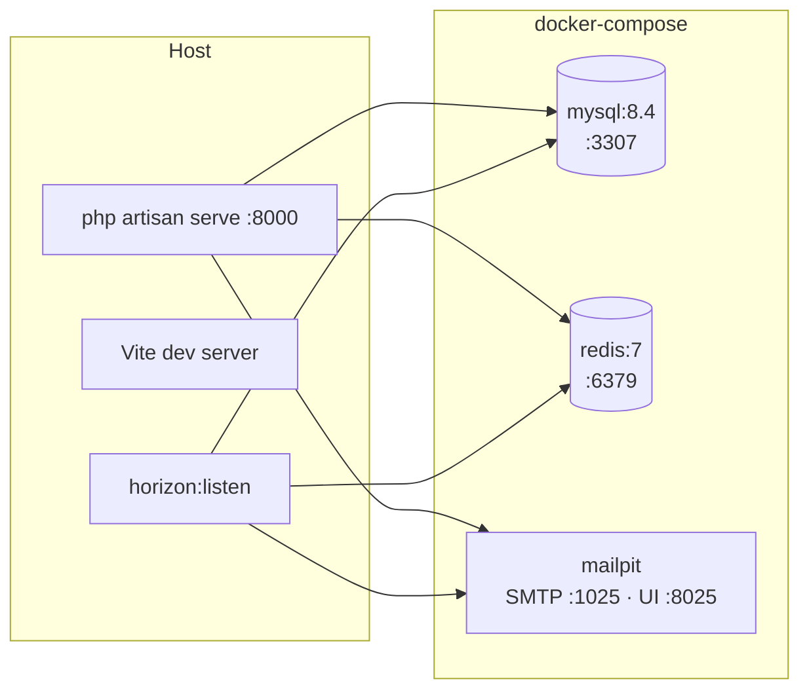

| Perintah | Fungsi |
|---|---|
| `make setup` | Dari `git clone` sampai 3 klinik contoh siap |
| `make dev` | Server + Vite + Horizon (restart otomatis saat kode berubah) |
| `php artisan tenants:migrate` | Migrasi semua tenant + sinkronisasi hak MySQL |
| `make test` | Seluruh suite |
| `make fresh` | Hapus semua tenant, migrasi & seed ulang |
| `make tenants` | Daftar tenant & alamatnya |
| `php artisan tenant:create <slug> "<nama>" <email> [--sync]` | Klinik baru |
| `php artisan tenant:delete <slug> [--force]` | Ekspor + hapus |

Port MySQL digeser ke **3307** agar tidak bentrok dengan MySQL/MariaDB XAMPP.

Variabel lingkungan penting (lihat `.env.example`):

| Variabel | Dev | Test |
|---|---|---|
| `CENTRAL_DOMAIN` | `simklinik.localhost` | `simklinik.test` |
| `TENANCY_DB_PREFIX` | `simklinik_` | `simklinik_test_` |
| `TENANCY_DB_USER_PREFIX` | `sk_` | `skt_` |
| `SESSION_DRIVER` / `CACHE_STORE` / `QUEUE_CONNECTION` | redis / redis / redis | redis (DB 15) / redis / sync |
| `SESSION_IDLE_TIMEOUT` | `15` | — |
| `MAIL_MAILER` | smtp → Mailpit | array |
| `REDIS_QUEUE_RETRY_AFTER` | `240` | bawaan config |
| `REDIS_QUEUE_CONNECTION` / `HORIZON_REDIS_CONNECTION` | `default` | `cache` (DB 15) |
| `HORIZON_BASIC_AUTH_USERNAME` / `_PASSWORD` | `operator` / `ganti-di-produksi` | `operator` / `rahasia-test` |
| `AUDIT_ACCESS_DEDUP_SECONDS` | `60` | `60` |

---

## 18. Peta kode

```
app/
├── Console/Commands/        CreateTenant, DeleteTenant
├── Enums/                   TenantStatus (aturan akses), AuditEvent
├── Events/                  TenantProvisioned, TenantProvisioningStepCompleted
├── Exceptions/              TenantProvisioningException, HardDeleteForbiddenException,
│                            TenantContextMismatchException
├── Http/
│   ├── Controllers/Tenant/  Auth/*, UserController, AuditLogController
│   ├── Middleware/          EnsureTenantIsUsable, ScopeSessionToTenant,
│   │                        EnforceIdleTimeout, PreventAccessFromTenantDomains,
│   │                        HandleInertiaRequests, AssignRequestId, LogRecordAccess,
│   │                        HorizonBasicAuth
│   └── Requests/Auth/       LoginRequest
├── Jobs/                    TenantAwareJob ← induk job klinik
│                            SendUserInvitation, SendPasswordResetLink (tenant)
│                            ProvisionTenant, DeleteTenantDatabase (pusat)
├── Listeners/               AuditSecurityEvents
├── Models/                  Tenant, Domain, TenantSetting (pusat)
│                            User, Polyclinic, AuditLog (tenant)
│                            ClinicalModel ← induk model klinis (S2)
│                            Concerns/Auditable, Builders/ClinicalBuilder
├── Notifications/           TenantAdminInvitation, ResetPasswordNotification
├── Policies/                UserPolicy
├── Providers/               TenancyServiceProvider  ← pusat semua kabel tenancy
│                            HorizonServiceProvider, AppServiceProvider
├── Rules/TenantSlug.php
├── Services/Tenancy/        TenantProvisioner, TenantExporter
└── Support/
    ├── Rbac/                PermissionCatalog, RoleAssignment
    ├── Tenancy/             TenantDatabaseManager, TenantDatabaseConfig,
    │                        TenantDatabaseGrants, UuidV7Generator
    ├── Audit/AuditLogger.php  satu-satunya jalan menulis jejak audit
    ├── QueueTimeoutGuard.php
    └── ForbiddenMessage.php

config/       tenancy.php, permission.php, auth.php (broker invitations), horizon.php,
              simklinik.php (idle timeout, database_grants, audit)
database/
├── migrations/              pusat
├── migrations/tenant/       tenant
└── seeders/                 DatabaseSeeder → TenantSeeder (pusat, lokal saja)
                             TenantDatabaseSeeder → RolesAndPermissions, Polyclinic (tenant)
routes/       tenant.php, central.php, console.php
```

**Model mana hidup di mana:**

| Model | Koneksi | Cara |
|---|---|---|
| `Tenant`, `Domain` | pusat | trait `CentralConnection` dari paket |
| `TenantSetting` | pusat | trait `CentralConnection` |
| `User`, `Polyclinic`, `AuditLog`, `Role`, `Permission` | tenant | koneksi default (ditukar bootstrapper) |

---

## 19. Catatan keputusan

Ringkas, dengan alasan. Keputusan yang sudah diambil tidak diperdebatkan ulang
tanpa informasi baru.

| # | Keputusan | Alasan | Alternatif yang ditolak |
|---|---|---|---|
| 1 | Database-per-tenant | Isolasi mudah dibuktikan saat audit; ekspor per klinik sederhana; blast radius kecil | Satu database + `tenant_id` — isolasi bergantung disiplin setiap query |
| 2 | User MySQL per tenant | Lapis isolasi yang tidak bisa dilanggar kode aplikasi | Satu user aplikasi untuk semua database |
| 3 | Identifikasi subdomain + pola domain di rute | Pemisahan terjadi saat pencocokan rute, tidak bergantung pada middleware yang bisa terlupa | Middleware saja; identifikasi lewat path |
| 4 | `db_host`/`db_port` disimpan sejak awal | Memindahkan tenant besar ke server lain cukup UPDATE satu baris | Menambahkannya "nanti kalau perlu" |
| 5 | Nama DB dari slug, PK UUID v7 | Terbaca saat troubleshooting; v7 berurutan untuk indeks InnoDB | Nama DB dari UUID; UUID v4 |
| 6 | Provisioning eksplisit dengan rollback, bukan event `TenantCreated` | Butuh urutan langkah yang jelas dan pembersihan saat gagal | Pipeline event bawaan paket |
| 7 | Ekspor wajib sebelum hapus | Retensi 25 tahun (Permenkes 24/2022) | Flag `--no-export` |
| 8 | `read_only` alih-alih blokir saat tunggakan | FR-M23.4 | Suspensi total |
| 9 | `clinic_admin` tanpa akses rekam medis | Minimisasi akses (UU PDP) | Admin = superuser |
| 10 | Tanpa "ingat saya", idle 15 menit | Komputer klinik dipakai bergantian | Sesi panjang |
| 11 | Undangan untuk admin pertama, bukan password sementara | Vendor tidak pernah tahu password admin klinik | Password dikirim via email |
| 12 | Test melawan MySQL/Redis sungguhan | Driver pengganti membuktikan hal yang salah | SQLite in-memory, driver `array` |
| 13 | `.localhost` untuk subdomain lokal | Tanpa setup DNS per mesin | dnsmasq, `/etc/hosts` |
| 14 | Hak MySQL per tabel + koneksi migrator terpisah | Satu-satunya cara membuat audit append-only dan larangan hard delete berlaku di level database; sekaligus mencabut DDL dari user runtime | `REVOKE` per tabel di atas grant level database (tidak didukung MySQL); trigger `BEFORE DELETE` (bisa di-`DROP` user yang sama, dan `TRUNCATE` melewatinya) |
| 15 | Jejak audit per tenant, bukan di pusat | Ikut terisolasi, terekspor, dan tidak terbaca vendor | Tabel audit global di database pusat |
| 16 | Akses baca dicatat per rekam medis yang dibuka + deduplikasi 60 detik | Menjawab pertanyaan sengketa tanpa membanjiri log | Mencatat setiap baris daftar; tanpa deduplikasi |
| 17 | `TenantAwareJob` memverifikasi, bukan memindahkan konteks | Model di properti job mungkin sudah di-restore dari database yang salah | Menginisialisasi ulang tenancy di `handle()` |
| 18 | Token dibuat di dalam worker | Payload terlihat di Horizon; vendor tidak boleh bisa mengambil alih akun klinik | Notifikasi ter-queue biasa yang membawa token |
| 19 | Basic auth fail-closed untuk Horizon sampai S1-10 | Dashboard memuat identitas pengguna klinik | Gate bawaan Horizon (terbuka tanpa syarat di `local`) |

---

## 20. Belum dibangun & utang yang diketahui

### Sisa Sprint 1

| Task | Dampak ke arsitektur |
|---|---|
| **S1-09** Suite isolasi lengkap | Satu berkas bukti isolasi; migrasi baru terpasang di semua tenant; masuk CI sebagai gerbang merge |
| **S1-10** Panel vendor | Login vendor terpisah di `admin.simklinik.*`; ubah status tenant lewat UI; Horizon pindah dari basic auth ke login vendor |
| **S1-11** Staging | Nginx + PHP-FPM, wildcard TLS via DNS-01, supervisor worker |

### Utang teknis & risiko terbuka

- **Arsip ekspor belum terenkripsi.** Wajib selesai sebelum ada tenant nyata.
- **Ekspor memuat tabel ke memori** (`cursor()` dengan PDO buffered). Aman untuk
  tenant baru, perlu streaming untuk tenant besar.
- **Belum ada 2FA** untuk `clinic_admin` (FR-M21.5).
- **Belum ada wajib ganti password** untuk akun yang password awalnya dibuat
  admin.
- **Penonaktifan akun** (FR-M21.7) baru ada policy-nya; UI dan pencabutan sesi
  belum.
- **Timer idle di klien belum diuji otomatis** — belum ada infrastruktur test JS.
- **Batas koneksi MySQL** (`max_connections=500` di dev) belum dihitung terhadap
  `pm.max_children` produksi (PRD §5.4 poin 5).
- **Perubahan status tenant** belum punya jalur resmi selain tinker.
- **Jejak audit belum tahan terhadap admin MySQL.** Hak per tabel menahan
  aplikasi, tetapi root database masih bisa mengubah baris. Rencana: rantai hash
  (setiap baris memuat hash baris sebelumnya) supaya perubahan terdeteksi.
- **Pertumbuhan `audit_logs`** di bawah retensi 25 tahun (FR-M22.5) belum punya
  strategi partisi atau arsip.
- **Perubahan permission pada peran** belum diaudit (event
  `PermissionAttached` sengaja belum didengarkan: seeder memicunya ratusan kali).
  Wajib sebelum ada UI pengaturan peran.
- **Laporan audit siap cetak** (FR-M22.9) dan ekspornya belum ada.
- **Kredensial `tenant_migrator`** masih kredensial admin pusat; tenant yang
  dipindah ke server DB lain butuh akun admin server itu.
- **Notifikasi job gagal** ke operator (Horizon) belum dikonfigurasi.
